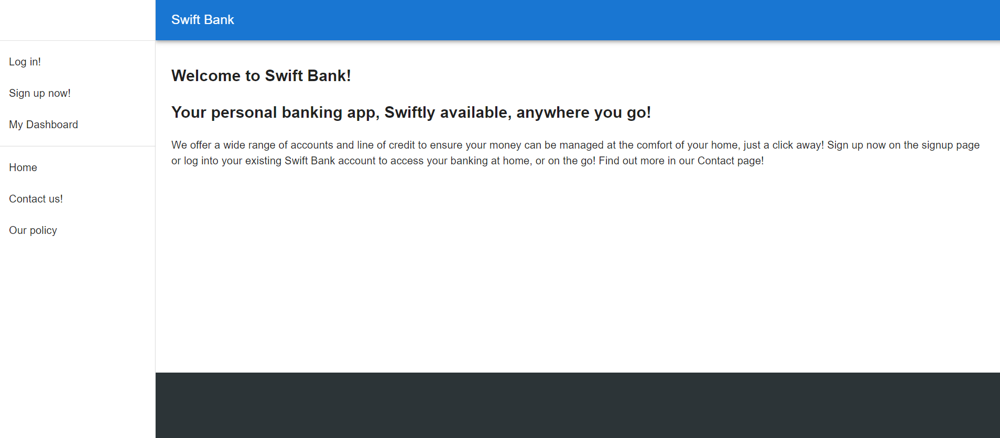

# Swift Bank

## Description

This application is a sample web application for a online bank that allows users to view their accounts, make transactions, and open accounts. Admins will be able to view all accounts, make approvals on certain accounts (such as loans). Some features are still work in progress.

The site is easy to navigate, and includes authorization controls to ensure that users must be logged in to use the site, and also that only admins are authorized to access certain pages.

To test out the site as a user, use "jane@abc.com" as the username, and "password" for a password. As admin features are currently unavailable, an admin login is not provided.

## Table of Contents

- [Installation](#installation)
- [Usage](#usage)
- [Credits](#credits)
- [License](#license)
- [Tests](#tests)

## Installation

This application has been deployed onto Heroku and should run without any installation required.

## Usage

This application has been deployed onto Heroku, here is a link to the deployed site:

[Swift Bank](https://swiftbank.herokuapp.com/)

Here is an image of the deployed application's dashboard on loading:

## Contributors

Here is a list of contributors to this application:

Ellison Chen: 

Alastair Lee: https://github.com/Honsumal

## License

N/A

## Tests

N/A

## Questions

Here are two links to reach out to me:

Github: https://github.com/pav1593

Email: 