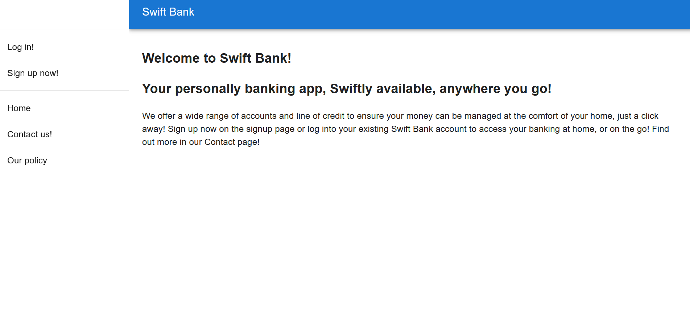

# Swift Bank

## Introduction

This application is a sample web application for a online bank that allows users to view their accounts, make transactions, and open accounts. Admins will be able to view all accounts, make approvals on certain accounts (such as loans). Some features are still work in progress.

The site is easy to navigate, and includes authorization controls to ensure that users must be logged in to use the site, and also that only admins are authorized to access certain pages.

To test out the site as a user, use "jane@abc.com" as the username, and "password" for a password. As admin features are currently unavailable, an admin login is not provided.

## Table of Contents 
1. [Installation](#installation)
2. [Usage](#usage)
3. [Test](#test)
4. [Images](#images)
5. [Credits](#credits)
6. [Licenses](#licenses)

## Installation 

clone the repository from the link, https://github.com/pav1593/swift-bank and run `npm install` to install necessary node packages.

## Usage

As a banking web app, used to manage accounts.

## Test

Run `npm run develop` to start the local program.

## Images

### Image of the Homepage

## Credits

Here is a list of contributors to this application:

JIa Liang (Ellison) Chen: 

Alastair Lee: https://github.com/Honsumal

## Licenses 

The MIT License: https://opensource.org/licenses/MIT
